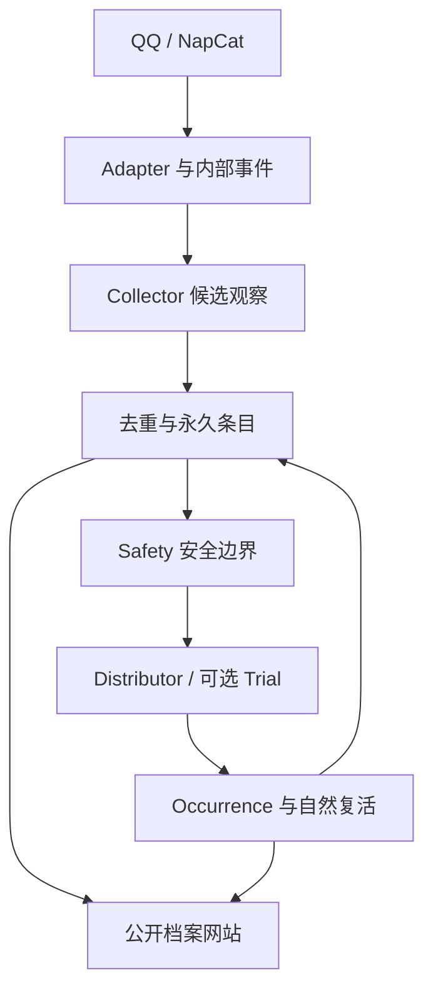

# Banshi · v0.1

一个存在于多个 QQ 群之间的自动内容发现与传播网络。群友正常发图、转发和回复，Banshi 自动采集、去重、建档、推送并观察反馈；网站是网络的观察窗口。**产品不使用 AI，也不分析“笑死 / 典”等文本语义。**

这是一个完整 Rails 应用：PostgreSQL、持久任务队列、对象存储、公开网站、账号、群认领和馆务流程共用一份领域数据。开发 Compose 保留 Fake NapCat。生产使用独立 NapCat 服务，扫码后自动识别账号与同步群。部署与扫码说明见 [生产交接](docs/production-handoff.md)。

## 五分钟开馆

安装 Docker Engine / Docker Desktop 与 Docker Compose v2.24+：

```bash
cp .env.example .env
docker compose up --build
```

打开 **http://localhost:3000**。首次启动自动迁移并载入 24 个群、36 位搬运者、120 条馆藏及其历史。首次构建需要下载 Ruby Gems、PostgreSQL 与系统依赖。

- 点击“虚拟 QQ”或登录页的“领取演示馆务证”，进入完整模拟工具。
- 演示账号：`curator@example.test`，密码：`Museum-demo-2026!`。
- 普通演示账号：`visitor1@example.test`、`visitor2@example.test`、`visitor3@example.test`，密码相同。
- 默认端口只绑定本机 `127.0.0.1`。这是本地开发 Compose；部署到互联网前阅读下面的部署说明。
- 重启不会重置数据。`db:seed` 有版本标记，重复执行保留已有历史。

```bash
docker compose exec web bin/demo all   # 在终端完成一条真实业务生命周期
docker compose exec web bin/verify     # PostgreSQL 上迁移、自动加载与测试
docker compose logs -f web worker      # 页面、OneBot、Job 与传播日志
docker compose down                   # 停止，保留数据库与媒体卷
```

## 不用 Docker

要求 Ruby 3.2+（推荐 3.3）、Bundler 4.0.20、PostgreSQL 16+、libvips 和中文字体。无需 Node、Redis 或前端构建服务器。

Ubuntu / Debian 安装系统依赖示例：

```bash
sudo apt-get install build-essential libpq-dev libyaml-dev libvips-dev fonts-wqy-microhei postgresql
gem install bundler -v 4.0.20
cp .env.example .env
```

创建自己有权限的 PostgreSQL 用户与数据库，将 `.env` 中的 `DATABASE_URL` / `TEST_DATABASE_URL` 改为连接地址。默认分别为 `banshi_development` / `banshi_test`。测试用户需要创建测试库和启用 `pg_trgm` 的权限。

```bash
bin/setup
bin/dev                         # 终端 A，网站
bin/jobs                        # 终端 B，GoodJob worker + 定时巡检
bin/verify
```

缺少 worker 时，浏览和同步网页操作仍可用，但模拟动作、候选到期和传播会等待队列。网页会显示排队状态并自动刷新，不会假装动作已经完成。

静态排版预览：[桌面](docs/previews/desktop.png) · [手机](docs/previews/mobile.png)。预览取自 Rails 实际数据库页面的离线排版，交互请启动应用体验。

## 网站怎么逛

首页优先展示正在传播、最近发现、自然再次出现、复活与可选 Trial。目录支持 S-ID / 标题 / 描述 / 公开群名 / 公开搬运者 / 标签搜索，按等级、群、安全标签和日期过滤、分页。

屎详情展示原始内容与附件、永久编号、自然 / 机器人计数、生命周期、试吃报告、群分布和数据库时间线。群页是文化档案馆：代表作、镇群之屎、出土、吃过、复读、经典、贡献和行为口味。搬运员页展示原始样本量、平滑信誉、代表作与历史。

还有热门、经典、最近复活、全部时间线、抢先试吃、10 种排行榜、随机吃一口、收藏夹和举报回执。网站评价每账号每条每种表情一次，可取消；与 QQ Reaction 分开存储。

普通用户在群页浏览档案。已认领管理员才看到“管理本群”，可分别开关采集和接收传播，并调整胃口、试吃、冷却、每日摄入量和隐私。馆务入口只对 `curator` 开放，用于安全审核、举报处理、打码替换、资源下架、候选隔离和可撤销合并；没有公开的 SaaS 后台侧栏。

## 默认自助餐与群设置

机器人进群后默认同时采集本群内容、接收外群传播，不需要更改备注或名片。机器人名片仅作为连接资料记录，查询失败、改名或更换机器人都不会改动群胃口。

管理员登录网站并认领群，在群页点击“管理本群”，分别调整“采集本群内容”和“接收机器人主动传播”；试吃意愿、配额、冷却与 Safety 仍各自生效。关闭接收传播后，试吃和普通投放都不会进入本群。认领不是默认参与的前提，仅用于验证设置权限。

升级迁移把原先“跟随名片”的空开关转为开启，保留已明确保存的 true / false，并移除旧模式字段。`BOT_MODE_RULES` 已退出配置；请用网站群设置。

## 完整模拟

在“虚拟 QQ”页面按顺序点击：

1. 群 A 发图（或群 B 发合并转发）。生成 pending Candidate，机器人不回复。
2. 3 位群友回复；可再添加 💩。页面显示每个判定组成。
3. 结束候选观察。符合规则后获得永久 `S-xxxxxx`，默认按普通 GREEN / public 策略进入直接传播。
4. 可对示例进行人工 Safety 标记，并可选开启提前 Trial。
5. 送到虚拟试吃群；收集 💩 / 😂 / 🥱，刻意保留一个沉默群。
6. 结算试吃。正向群 / 全部试吃群等原始指标完整保留；沉默是 unknown。
7. 安排普通传播，受安全、冷却、配额和已见内容限制。
8. 另一个群自然复读，沿用 S-ID；90 天后再次出土，满足长期指标后成为 CLASSIC。

模拟时钟只作用于当前动作记录，能够快进观察期与生命周期。HTTP 只排队，`SimulationActionJob` 执行真实领域服务。测试也运行这条链路。终端可用 `bin/demo all`，或逐项 `bin/demo image`、`bin/demo replies` 等；全部名称见 `SimulationProcessor::ACTIONS`。

Seed 是原创虚构图片和聊天记录，不含真实群号、QQ 号或私人信息。PNG 原图在 `db/fixtures/media/`，生成器在 `DemoFixtures`；不是远程占位图。历史统计由实际 Occurrence 和 Interaction 汇总，TrialResult 由真实结算规则计算。

## 领域与数据归属



核心关系均有外键和索引：

- `Group` 独立于 `BotAccount`；`GroupBotMembership` 描述访问通道，`BotConnection` 描述 NapCat 连接。换号、换实例、退出群不会删除群历史。
- `RawEvent → InternalEvent → Message` 在入口完成 OneBot 标准化；业务服务不接收原始 webhook JSON。
- `Content → Attachment → Asset` 支持多资源；`ForwardNode` 保留层级，`forward_tree` 保留有序文本、图片和嵌套结构。文本节点作者默认匿名。
- `Candidate` 保存观察窗口、来源、规则组成、信誉快照与重复结果。状态有 pending / accepted / expired / rejected / duplicate / unsafe。
- `ShitEntry` 的 S-ID 来自 PostgreSQL 主键序列；号码不回收，允许有空号。重命名不改变编号。
- `ShitOccurrence` 区分 `NATURAL`、`BOT_TRIAL`、`BOT_DISTRIBUTION`、`BOT_CLASSIC`；机器人发得多不会增加自然传播指标。
- `TrialRun → TrialDelivery → Delivery` 记录席位、发送决策与回执；`TrialResult` 保存结算证据。`Interaction` 按消息目标与参与者关联。
- `SafetyDecision`、`Report`、`AuditLog`、`EntryMerge` 保留人工决策和修正历史。灵活规则解释用 JSONB，核心关系不塞进单个 JSON。

主要边界：`Collector`、`CandidateEvaluator`、`DuplicateDetector`、`ReputationCalculator`、`SafetyEvaluator`、`GroupMatcher`、`TrialSelector`、`TrialDispatcher`、`TrialEvaluator`、`Distributor`、`ClassicEvaluator`。Controller 负责认证、参数和呈现。

## 规则与可解释性

完整 ENV 清单见 [.env.example](.env.example) 与 [配置参考](docs/configuration.md)。所有业务参数经 `AppConfig` 类型转换、默认值和启动检查；群胃口在数据库运行时配置。

**采集：** 默认观察 5 分钟，至少 1 名独立非作者参与、得分至少 1.5。每人只计最强信号：回复 2、引用 2.5、Reaction 1.5、再次自然发送 5；合并转发基础分 1。作者自回、自赞、机器人回声和撤销互动不计。到期才建档；已知重复可直接记原编号下的新出现。超过补录窗口的过期消息不追认。

**信誉：** 默认 Beta 先验 3 / 3，新用户中性；达到 5 份已结算样本后才对边界候选做至多 1 分修正。原始候选、成功、自然命中、经典数和计算说明都保留，信誉不能单独换来建档。

**去重：** 原文件 SHA256 完全匹配；实际运行的 libvips + 32×32 灰度 DCT、8×8 低频 pHash 用于候选近似。默认汉明距离 ≤5 确认、≤12 提示可能重复，另有纵横比和附件数量约束。缩放、JPEG 和亮度变化有变换测试。小裁剪、水印和二次截图可能超出阈值，因此保留置信度、待确认结果和人工合并 / 拆回；不能把 pHash 当作语义保证。扫描范围默认最近 2,000 件，可配置；大库可替换检索策略而不改变内容模型。

**试吃：** 默认可选，仅 OPT_IN 群提前接收，不改变普通内容的传播资格。`TRIAL_REQUIRED_BEFORE_DISTRIBUTION=true` 恢复原有强制 Trial、最少席位与 FALLBACK 补位策略。Reaction、reply、quote 进入反馈统计；沉默是 unknown，只有明确 🥱 是负反馈。

**传播：** 先安全，再等级、胃口、群冷却、每日和全局分钟配额、群是否自然见过、是否已投放。同内容同群预留也是占位，避免并发超配额。NORMAL / HOT 可以普通投放；CLASSIC 还需要群接受经典，考古重投需要明确允许并超过重投间隔。

**长期：** HOT 来自配置的短期自然出现与试吃表现；CLASSIC 默认需要至少 8 次自然出现、3 个自然群、90 天寿命和一次沉寂复活。即时 Reaction 与机器人覆盖量不能直接产生典藏。乱序自然记录会重算首次发现与复活点。

## 安全与隐私

普通未知内容默认 `GREEN + public`，这代表常规传播策略，不代表图片语义经过自动审核。系统不使用 AI 识图。馆务可审核 GREEN 或带多标签的 YELLOW；只有接受全部 YELLOW 标签的群才能收到。RED 永不自动跨群传播，PRIVACY / EXTREME 是平台硬禁标签，群配置不能移除。文件 SHA 黑名单、来源黑名单、资源隐藏和传播暂停独立生效。

举报需要网站账号。默认 3 个不同账号的未决举报暂停传播；隐私或未成年人原因立即 RED、隐藏并下架关联资产。处理回执出现在本人主页，驳回不会自动恢复安全等级。所有未决举报关闭、资源完成处理并通过安全审核后，馆务可在该 S-ID 的安全档案中明确点击“记录复核并恢复传播”；该操作再次检查安全限制并单独审计，避免因为高热度或举报关闭而意外解锁。

公共页面不输出外部 QQ 标识。群可以匿名、只公开统计、隐藏整个页面、隐藏成员；只公开统计的群不会出现在具体条目时间线和试吃席位关联中。未知搬运者默认匿名且不公开个人主页。公开页面同时遵守内容可见性与来源群隐私设置。

媒体通过权限检查后的 Rails 路由读取，不放在 `public/`，不提供可绕过下架的永久 S3 公链。原图可下架，上传打码替代图会替换附件引用、保留原资产关系与审计；不会自动降低条目安全等级。响应 `no-store`，避免浏览器继续缓存被撤下内容。

## 网站账号与群认领

账号使用独立邮箱 + BCrypt 密码，无 QQ 登录假设。至少 12 字符，CSRF 防护、权限检查、登录限流和 session 更新已接入。这个版本不包含邮件发送、邮箱验证和自助找回密码；维护者可以使用 Rails 控制台处理账号恢复。

登录 → 生成 `CLAIM-XXXXXXXX` → 在目标群 @机器人发出 → Adapter **重新获取发送者角色** → owner/admin 才建立网站 User 与 Group 的关系。默认 10 分钟、最多 6 次验证尝试、一次使用；数据库保留摘要，原始事件中的验证码会脱敏。网站 User 不绑定真实 QQ 号。

Fake 认领页可选择虚构群和成员来演示通过 / 拒绝。真实消息流程与模拟使用同一个 `ClaimVerifier`。馆务账号在正式环境用 `bundle exec ruby bin/create-curator` 创建，不启用演示快捷登录。

## NapCat 的真实接入

生产部署使用 [compose.production.yaml](compose.production.yaml) 和独立 [NapCat Compose](deploy/napcat/compose.yaml)。详见 [生产部署与扫码交接](docs/production-handoff.md)。

`bin/napcat-bridge` 自动探测登录账号，建立 BotAccount / BotConnection，同步群与 Bot 身份，并通过正向 WebSocket 接收群事件；RealNapCatAdapter 通过 HTTP 发送。无需在数据库预填 QQ 号、群号或连接 ID。未登录时 bridge 重试，Rails 和 worker 正常工作。多实例通过 `NAPCAT_CONNECTIONS` 与 `NAPCAT_CONNECTION_TOKENS` 扩展。

[协议能力核验](docs/napcat-capabilities.md) 保留官方文档与源码证据；没有 QQ 登录态时，不能声称已经验证真实群消息、Reaction 或发送。

## 对象存储与任务

`Storage::Registry.current` 返回 LocalStorage 或 S3CompatibleStorage。`STORAGE_PROVIDER=local` 使用 `storage/media`；`s3` 使用桶、endpoint、region、access / secret key，兼容 MinIO 等服务。对象键是 SHA256 派生路径；LocalStorage 拒绝路径穿越与符号链接逃逸。S3 用 AWS SDK，测试使用 SDK stub 核验请求；没有在当前环境连接真实 S3 桶。

GoodJob 使用同一个 PostgreSQL 作为持久队列，不需要 Redis。定时 `MaintenanceSweepJob` 补扫到期候选、试吃、待处理事件和任务、过期认领以及传播；`StatisticsSweepJob` 刷新信誉、经典、群统计与榜单。具体任务包括：

`CandidateEvaluateJob`、`CandidateExpireJob`、`DuplicateScanJob`、`TrialDispatchJob`、`TrialFinishJob`、`DeliveryJob`、`DistributionJob`、`ReputationRefreshJob`、`ClassicEvaluationJob`、`GroupStatsRefreshJob`、`LeaderboardRefreshJob`、`ExpiredClaimCleanupJob`。

任务失败写结构化日志、GoodJob 记录和 `SystemError`；原始 OneBot payload 默认保留 14 天后脱敏。`AuditLog` 记录认领、安全、合并和群配置。`/up` 是公开存活检查；`/health/details` 只对馆务开放。多实例网站的限流应改用共享缓存，默认 MemoryStore 适合当前单 Web 进程部署。

## 持续扩展

- **内容类型：** 新增入口转换和 Content 处理器，复用附件 / 资产 / 出现关系；把可采集类型加入 Collector 的类型集合，并为发送 Adapter 加序列化。既有 Entry / Occurrence 表不需要重建。
- **安全标签 / 策略：** 在配置中添加标签；给 `SafetyEvaluator` 增加可解释规则，结果仍是 allowed + reasons。群匹配只能增加限制，不能绕过硬禁。扩展网站 `TAG_NAMES` 只影响中文展示。
- **试吃策略：** 以 `TrialSelector.call(entry:, now:)` 返回群；记录 `TrialRun.strategy`。改变选群实现不影响投放回执和结算模型。
- **传播算法：** 替换 Distributor 的候选排序或选择器，继续经 `GroupMatcher` 和发送前 Safety 检查。所有结果保留 decision / explanation，不能用新分数绕过安全。
- **Feature Flag：** 在 `config/app_config_schema.json` 的 features 加键、类型与默认值，业务只读 `AppConfig.features.xxx`；运行 `ruby script/config_reference.rb` 同步 `.env.example` 与配置参考，并测试开 / 关两种路径。
- **更大去重库：** 保留 SHA / pHash / 置信度字段，替换 DuplicateDetector 的近邻候选检索；可以另加裁剪鲁棒 hash、人工匹配或更精细指纹，而不改变永久 ID。

## 部署与验收边界

本仓库包含 Git 历史、Dockerfile、Compose、migrations、fixtures、测试和 GitHub Actions（原生 PostgreSQL 16）。项目仓库为 [razuberiii/banshi](https://github.com/razuberiii/banshi)；本次通过独立分支和 PR 导入实现，保留分阶段开发记录。

正式部署设置独立数据库 / 媒体卷 / SECRET_KEY_BASE，关闭 `DEMO_ENABLED` 和 `SEED_DEMO`，配置 HTTPS、允许的主机名和代理、真实账号及存储凭据，再创建馆务账号。生产环境启动校验会拒绝默认密钥或演示开关。默认 Compose 中的数据库密码只用于本机演示。

本次环境的详细测试结果和工具限制见 [验证记录](docs/verification.md)。真实 QQ 登录、实际 QQ Reaction 版本兼容和真实 S3 服务属于外部集成验收；它们没有被冒充为已完成的在线验证。
